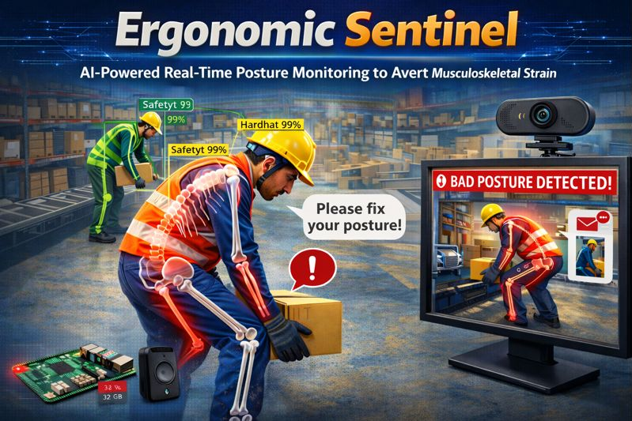

# Ergonomic-Sentinel-AI-Powered-Posture-Monitoring-for-Safety
Real-time AI system to monitor worker posture and prevent injuries by detecting poor posture and providing corrective feedback.
<div align="center">
  
  <h1>Ergonomic Sentinel 🛡️</h1>
  <h3>Real-Time AI-Powered Posture & PPE Monitoring to Prevent Workplace Injury</h3>

  <!-- Badges Section - Add relevant ones -->
  [](LICENSE)
  [](https://www.python.org/)
  [](https://opencv.org/)
  [](https://ultralytics.com/)
  [](https://www.raspberrypi.com/)
  <br>
  [](https://github.com/Ammar-Ali234/Ergonomic-Sentinel-AI-Powered-Posture-Monitoring-for-Safety)
  [](https://youtu.be/your-demo-link) <!-- Add your video link -->

</div>

---

## 🔍 Project in 60 Seconds
Workplace injuries from poor posture and missing safety gear are a **silent, costly epidemic**. Ergonomic Sentinel is the **proactive guardian** that stops injuries before they happen.

**How?** A single Raspberry Pi 5 runs **dual AI models** to simultaneously monitor worker posture and Personal Protective Equipment (PPE) in real-time, delivering instant voice feedback and alerts.


---

## 💡 The Problem
> "The most common workplace injuries are the most preventable."
- **Global Economic Drain:** Work-related musculoskeletal disorders cost the global economy **$2.1 trillion** annually [[1]](https://www.who.int/news-room/fact-sheets/detail/musculoskeletal-conditions).
- **Local Crisis in Pakistan:** An estimated **3.8 million workdays** are lost each year to ergonomic injuries [[2, 3]](https://github.com/Ammar-Ali234/Ergonomic-Sentinel-AI-Powered-Posture-Monitoring-for-Safety).
- **Human Toll:** Studies show **over 77%** of academic staff report work-related musculoskeletal pain [[4]](https://github.com/Ammar-Ali234/Ergonomic-Sentinel-AI-Powered-Posture-Monitoring-for-Safety).
- **Reactive Failure:** Traditional safety is a **reactive cycle** (Injury → Report → Loss). Safety officers can't monitor everyone.

## 🛡️ Our Solution: The Ergonomic Sentinel
We transform safety from a **reactive checklist** into a **proactive, intelligent layer of protection**. Our system acts as a digital sentinel—a guardian that watches, understands, and intervenes in real-time to protect workers.

### ✨ Key Features
| Feature | What It Does | Impact |
| :--- | :--- | :--- |
| **🎯 Real-Time Pose Guardian** | Uses YOLO-based pose estimation to analyze body posture and joint angles. | Prevents chronic strain by giving **immediate, corrective voice feedback**. |
| **✅ PPE Compliance Monitor** | Uses object detection to verify hard hats, safety vests, etc. | Ensures safety protocol compliance with **instant email alerts** to officers. |
| **🧠 Intelligent Risk Scoring** | Employs a biomechanical formula (based on NIOSH/OSHA) to calculate injury risk. | Moves beyond simple detection to **predict and prevent** high-risk situations. |
| **💰 Ultra-Cost Effective** | Built on a **Raspberry Pi 5** with total hardware costs **under $150**. | Makes enterprise-level safety monitoring **accessible to any business**. |
| **🔒 Privacy-First Design** | Uses **skeletal keypoints only** (no facial recognition). No permanent video storage. | Protects worker privacy while ensuring safety. |

**Live Demo - See It In Action**
 <!-- Replace with a GIF of your system working -->
*The system providing real-time posture feedback and detecting a missing hard hat.*

### ⚙️ Technical Highlights
- **Dual-Model Edge AI:** Runs **YOLO11 (Pose)** and **YOLOv8 (PPE Detection)** simultaneously on a Raspberry Pi 5.
- **High Performance:** **<200ms** end-to-end latency with **>92% accuracy**.
- **Scientific Rigor:** Risk algorithm incorporates **NIOSH Lifting Equation** principles and **OSHA guidelines**.

## 🏗️ How It Works
The system follows a streamlined pipeline:

1.  **Capture:** Live video feed is captured via webcam.
2.  **Process & Detect:** Frames are processed in parallel:
    - **Path A (Pose):** YOLO11 extracts skeletal keypoints to calculate joint angles.
    - **Path B (PPE):** YOLOv8 detects and classifies safety equipment.
3.  **Analyze & Decide:** A custom risk engine evaluates posture and PPE status against safety thresholds.
4.  **Act:**
    - **For Posture Risk:** Triggers a **gentle, localized voice alert**.
    - **For PPE Violation:** Sends an **automated email** with a snapshot to the safety officer.


*(If you have a visual of the full architecture, place it here)*

## 🛠️ Hardware & Software
**Bill of Materials (Approx. $150)**
- Raspberry Pi 5 (8GB)
- Raspberry Pi Power Adapter
- Logitech Webcam (e.g., C920)
- MicroSD Card (32GB+)
- Portable Speaker

**Tech Stack**
- **Programming Language:** Python
- **AI/Computer Vision:** YOLOv8, YOLO11 (via Ultralytics), OpenCV
- **Alert System:** PyAudio (Voice), SMTPLib (Email)
- **Dashboard/UI:** Flask (Web Interface)
- **Edge Device:** Raspberry Pi OS

## 🚀 Project Impact & Vision
We built Ergonomic Sentinel to **honor the dignity of work** by protecting the people who do it.
- **Current Impact:** A functional prototype that proves **proactive, affordable safety is possible**.
- **Future Vision:** To become the standard for intelligent workplace safety, with features like **multi-camera support, predictive analytics, and mobile integration**.

📖 **See our full project story, challenges, and technical deep dive in our [project documentation](docs/).**

## ⚡ Getting Started
Want to try it yourself? Here's a quick start guide.

**Prerequisites**
- Raspberry Pi 5 (or a Linux/MacOS/Windows machine for testing)
- Python 3.9+
- Webcam

**Quick Setup**
```bash
# 1. Clone the repository
git clone https://github.com/Ammar-Ali234/Ergonomic-Sentinel-AI-Powered-Posture-Monitoring-for-Safety.git
cd Ergonomic-Sentinel-AI-Powered-Posture-Monitoring-for-Safety

# 2. Install dependencies
pip install -r requirements.txt

# 3. Run the main application
python main.py
